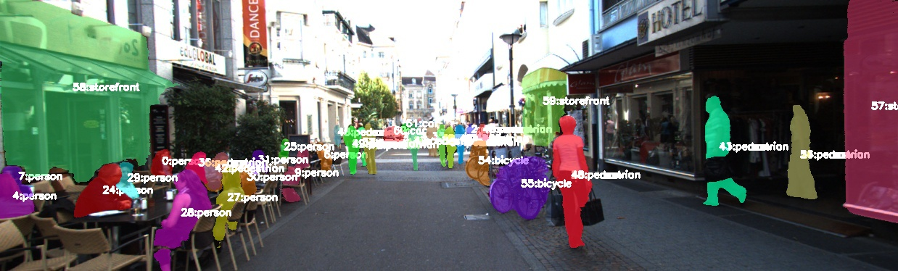
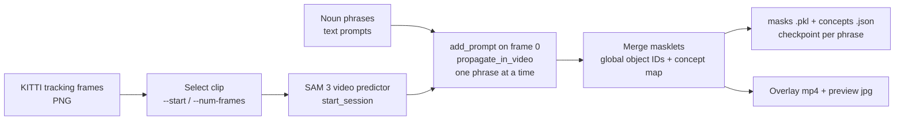

# ComputerVision_Research

Open-vocabulary segmentation and tracking experiments on driving video (KITTI tracking, BDD100K) using Meta's SAM 3 promptable concept segmentation (PCS), with the vendored TrackEval toolkit as the intended evaluator.



*Middle frame of a 20-frame KITTI sequence 0019 clip (frames 188-207) segmented and tracked with eight text prompts. Each mask is labelled `<object id>:<noun phrase>`. Produced by `scripts/run_sam3_kitti_video.py`.*

## What this repo does

- Runs SAM 3 text-prompted (noun-phrase) segmentation on BDD100K images, including optional positive/negative box prompts, and renders ground truth beside predictions (`scripts/run_sam3_bdd_demo.py`).
- Runs SAM 3 video PCS plus tracking on KITTI tracking sequences, one noun phrase at a time, then merges the resulting masklets into one global object-ID space (`scripts/run_sam3_kitti_video.py`).
- Uses open-vocabulary prompts that are not in the BDD or KITTI label sets (for example "bridge", "gas station pump", "license plate", "storefront", "umbrella").
- Checkpoints masks and per-concept object counts after every prompt, so a long run that crashes still leaves usable partial output.
- Runs on CUDA, or on CPU/Apple Silicon through a small compatibility layer added to the vendored SAM 3 code.

## My contributions

| Item | Where |
|---|---|
| BDD100K PCS demo: text prompts, geometric +/- box prompts, GT-vs-prediction side-by-side rendering | `scripts/run_sam3_bdd_demo.py` |
| KITTI video PCS + tracking driver: multi-noun-phrase loop, masklet merge into global IDs, per-prompt checkpointing, overlay video writer, `--from-masks` re-render without inference | `scripts/run_sam3_kitti_video.py` |
| Noun-phrase prompt list used for a longer KITTI run | `scripts/sam3_kitti_prompts.txt` |
| Non-CUDA support patches inside vendored SAM 3: CPU/MPS device selection, `.cuda()` redirect shim, Triton-free EDT fallback | `sam3/sam3/model/device_utils.py`, `sam3/sam3/model/edt.py`, `sam3/sam3/model_builder.py` |
| Setup notes (Apple Silicon) | `SAM3_SETUP.md` |
| Example outputs (7 BDD side-by-side images, 2 KITTI previews, 1 concept-count JSON) | `outputs/` |

## Third-party code (vendored, not written by me)

| Directory | Upstream | Licence |
|---|---|---|
| `sam3/` | Meta SAM 3 ("Segment Anything with Concepts"), see `sam3/README.md` | SAM License (Meta), `sam3/LICENSE` |
| `TrackEval/` | Jonathon Luiten's TrackEval (HOTA, CLEAR MOT, Identity, KITTI/MOTS/BDD runners) | MIT, `TrackEval/LICENSE` |

All credit for the models, training code and evaluation metrics belongs to their authors. The SAM License governs use and redistribution of `sam3/` and the model weights; read it before reusing them. The patches listed above are the only changes I claim in `sam3/`.

## Pipeline



The BDD demo is the single-image variant: image, text prompt (optionally plus +/- boxes), SAM 3 image model, side-by-side PNG.

## Quick start

### 1. Environment

SAM 3 upstream requires Python 3.12+, PyTorch 2.7+ and a CUDA 12.6+ GPU (see `sam3/README.md`). On Apple Silicon the repo falls back to CPU (see `SAM3_SETUP.md`).

```bash
python3.12 -m venv .venv_sam3 && source .venv_sam3/bin/activate
# CUDA host (per sam3/README.md):
pip install torch==2.10.0 torchvision --index-url https://download.pytorch.org/whl/cu128
# Mac / CPU: install the default torch build from PyPI instead
pip install -e sam3
pip install opencv-python pillow numpy
```

`opencv-python`, `pillow` and `numpy` are imported by the scripts; I have not verified that `pip install -e sam3` pulls them in, so they are listed explicitly. `ffmpeg` is optional (used for H.264 output; otherwise OpenCV's `mp4v` writer is used).

### 2. Weights

SAM 3 weights are gated on Hugging Face and are not in this repo.

1. Request access at https://huggingface.co/facebook/sam3 and wait for approval.
2. Create a read token at https://huggingface.co/settings/tokens, then `hf auth login`.
3. The image model is built with `load_from_HF=True`, so it downloads on first run. The video script calls `build_sam3_predictor(version="sam3", ...)` without a checkpoint path; I did not verify where it resolves weights from on a fresh machine.

### 3. Data layout

Datasets are not committed (`Research_Data/` is git-ignored). The scripts expect, relative to the repo root:

```
Research_Data/
  data_tracking_image_2/training/image_02/<seq>/000000.png ...   # KITTI tracking, e.g. <seq> = 0019
  BDD100K/
    hf_dgural_bdd100k/data/*.jpg                                 # images (preferred)
    images/100k/val_data/*.jpg                                   # fallback image dir
    labels/det_val_simplified.json                               # BDD detection labels
```

### 4. Run

```bash
# BDD100K image demo -> outputs/bdd_sam3_demo/
python scripts/run_sam3_bdd_demo.py
SAM3_PROMPT="bridge" SAM3_IMAGE=c0e631f4-cf85b543.jpg SAM3_CONF=0.3 python scripts/run_sam3_bdd_demo.py
# geometric refinement (normalised cx,cy,w,h)
SAM3_PROMPT="bridge" SAM3_IMAGE=c0e631f4-cf85b543.jpg \
  SAM3_POS_BOX=0.22,0.32,0.28,0.22 SAM3_NEG_BOX=0.88,0.40,0.10,0.18 python scripts/run_sam3_bdd_demo.py

# KITTI video PCS + tracking -> outputs/kitti_sam3_video/
python scripts/run_sam3_kitti_video.py --seq 0019 --prompts pedestrian --start 188 --num-frames 40
python scripts/run_sam3_kitti_video.py --seq 0019 --prompts-file scripts/sam3_kitti_prompts.txt --start 188 --num-frames 20
# re-render video from saved masks, no inference
python scripts/run_sam3_kitti_video.py --seq 0019 --start 188 --num-frames 20 --from-masks outputs/kitti_sam3_video/<stem>_masks.pkl
```

Device: `SAM3_DEVICE=cuda|mps|cpu` overrides auto-detection. The video script picks CUDA if available, otherwise CPU; MPS is redirected to CPU for video unless `SAM3_ALLOW_MPS_VIDEO=1`. The script's own timing note estimates about 3 s/frame/prompt on an A100-class GPU and about 25 s/frame/prompt on CPU (a rough hint printed by the script, not a benchmark).

Large outputs (`*.mp4`, `*.pkl`, `frames_*/`) are git-ignored; only previews and JSON are kept.

## Results

**No tracking metrics (HOTA, IDF1, MOTA, etc.) are reported.** No TrackEval result files, logs or CSVs exist in this repo, and no ground-truth comparison has been run on the tracking output. The outputs here are qualitative.

What is recorded, from `outputs/kitti_sam3_video/0019_explore_concepts.json` (KITTI seq 0019, frames 188-207, confidence 0.3): number of unique masklets SAM 3 produced per prompt. These are detection/track counts, not accuracy.

| Prompt | Unique masklets |
|---|---|
| person | 33 |
| pedestrian | 19 |
| bicycle | 5 |
| backpack | 4 |
| storefront | 3 |
| car | 2 |
| umbrella | 0 |
| traffic light | 0 |

The overlap between "person" (33) and "pedestrian" (19) shows the same people being picked up under two phrases and given separate IDs by the merge step; the merge does not de-duplicate across concepts.

Qualitative BDD100K examples are in `outputs/bdd_sam3_demo/` (for example `c0e631f4-cf85b543_bridge_geo.png`, which shows a positive and a negative box prompt refining an open-vocabulary "bridge" mask).

### Producing quantitative numbers

The vendored TrackEval includes KITTI-MOTS and KITTI runners (`TrackEval/scripts/run_kitti_mots.py`). This needs (a) KITTI-MOTS ground truth, (b) tracker output converted to the MOTS text format, and (c) a fix noted under Limitations. This repo has no exporter from `*_masks.pkl` to MOTS format yet. Once those exist, per the upstream TrackEval usage:

```bash
cd TrackEval
python scripts/run_kitti_mots.py --GT_FOLDER <kitti_mots_gt> --TRACKERS_FOLDER <trackers> \
  --TRACKERS_TO_EVAL <name> --METRICS HOTA CLEAR Identity
```

I have not run this; flag names follow the upstream script and should be checked against `--help`.

## Occlusion and identity

What the code does: each noun phrase is prompted on frame 0 of the clip and SAM 3's video tracker propagates masklets through the clip. Identity and occlusion handling are entirely SAM 3's internal tracker; this repo adds no occlusion logic, appearance re-identification or ID-switch analysis. Merged masklets from different phrases receive distinct IDs even if they cover the same object.

What is not shown: there is no occlusion-specific experiment, measurement or output in this repo, so I make no claim about how well identities survive occlusion. Planned next steps are listed below.

## Limitations and next steps

- No quantitative evaluation yet; no converter from SAM 3 masklets to KITTI-MOTS format.
- `TrackEval/trackeval/datasets/` was previously excluded by the root `.gitignore`; it is now tracked, so `import trackeval` works from a fresh clone. An exporter from the saved masks to TrackEval's MOTS format is still to be written before HOTA/IDF1 can be reported.
- Prompts are applied on frame 0 only, so objects that enter later or are occluded at frame 0 can be missed.
- Short clips only (20-40 frames in the documented runs); one phrase per pass makes runs slow, especially on CPU.
- Cross-concept duplicates ("person" vs "pedestrian") are not merged.
- Next: occlusion-focused clips with measured identity switches (IDF1, ID switches), appearance re-ID for long occlusions, and cross-concept de-duplication.

## Tests

`pip install pytest numpy scipy opencv-python && pytest tests/` runs 6 regression tests: the CPU/Apple-Silicon distance-transform fallback against `scipy.ndimage.distance_transform_edt` (max error ~5e-8), and the KITTI overlay helpers on OpenCV 5. They need no SAM 3 checkpoints.

## Related work

[lunar-occlusion-tracking](https://github.com/sadeeqgandalf/lunar-occlusion-tracking): a simulation study in which occlusion-aware multi-object tracking raises identity retention through short occlusions from 0% to about 30% through short occlusions; long occlusions need appearance re-ID, which the segmentation work here is meant to support.
